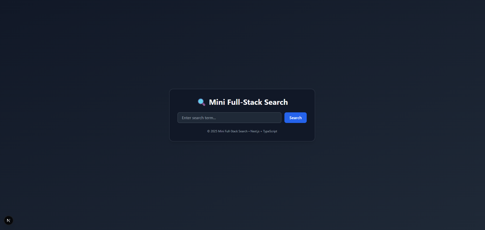
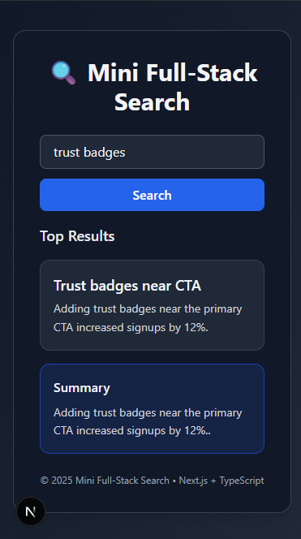

# 🧠 Mini Full-Stack Search

A compact full-stack search app built with **Next.js** and **TypeScript**.  
This project demonstrates a simple keyword-based search functionality using a local JSON dataset — no external database or APIs required.

## 📱 Screenshots

### Desktop View


### Mobile View


---

## 🚀 Features

- 🔍 Search through a local dataset (`data/faqs.json`)
- ✅ Returns top 3 results ordered by relevance
- ⚡ Simple scoring system (+1 for title match, +0.5 for body match)
- ⚙️ API endpoint with full error handling
- 💬 Bonus: Combined summary and source IDs
- 🎨 Minimal frontend with loading, empty, and error states
- 📱 Responsive design that works on all devices

---

## 🧩 Tech Stack

- **Frontend:** Next.js (React + TypeScript)
- **Backend:** Next.js API Routes (`pages/api/search.ts`)
- **Data:** Local JSON file (`data/faqs.json`)
- **Styling:** CSS Modules
- **Runtime:** Node.js 18+
- **Package Manager:** npm

---

## 🗂️ Project Structure

```
spiralyze-task-a/
├── data/
│   └── faqs.json          # FAQ data in JSON format
├── pages/
│   ├── api/
│   │   └── search.ts      # API route for search functionality
│   └── index.tsx          # Main page component
├── public/                # Static files
├── styles/                # Global styles
├── README.md              # This file
└── package.json           # Project dependencies and scripts
```

---

## 🧰 Getting Started

### Prerequisites

- Node.js 18 or later
- npm (comes with Node.js)

### Installation

1. Clone the repository:
   ```bash
   git clone https://github.com/bagindaisfa/spiralyze-task-a.git
   cd spiralyze-task-a
   ```

2. Install dependencies:
   ```bash
   npm install
   ```

3. Start the development server:
   ```bash
   npm run dev
   ```

4. Open your browser and navigate to:
   ```
   http://localhost:3000
   ```

---

## 📡 API Documentation

### Search Endpoint

**Endpoint:** `POST /api/search`

**Request Body:**
```json
{
  "query": "search terms here"
}
```

**Example Request:**
```bash
curl -X POST http://localhost:3000/api/search \
  -H "Content-Type: application/json" \
  -d '{"query": "trust badges"}'
```

**Success Response (200 OK):**
```json
{
  "results": [
    {
      "id": "1",
      "title": "Trust badges near CTA",
      "body": "Adding trust badges near the primary CTA increased signups by 12%."
    }
  ],
  "summary": "Adding trust badges near the primary CTA increased signups by 12%.",
  "sources": ["1"]
}
```

**Error Response (400 Bad Request):**
```json
{
  "error": "Query parameter is required"
}
```

### API Logic

#### Scoring System
- **+1 point** if the query appears in the title (case-insensitive)
- **+0.5 points** if the query appears in the body
- Results are sorted by score in descending order
- Returns top 3 highest-scoring results

#### Error Handling
- `400 Bad Request`: Empty or missing query parameter
- `200 OK` with empty results: No matches found

#### Response Fields
- `results`: Array of matching items with id, title, and body
- `summary`: Concatenation of top result bodies (2–3 sentences)
- `sources`: Array of matched item IDs

---

## 🧪 Example Queries

| Query | Expected Top Result |
|-------|---------------------|
| "trust badges" | "Trust badges near CTA" |
| "conversion rate" | [Matching result about conversion rates] |
| "A/B testing" | [Matching result about A/B testing] |

---

## 🛠️ Development

### Available Scripts

- `npm run dev` - Start development server
- `npm run build` - Build for production
- `npm start` - Start production server
- `npm run lint` - Run ESLint

### Adding New Data

1. Edit the `data/faqs.json` file
2. Add new entries following the existing format
3. The search will automatically include the new data

---

## 🙏 Acknowledgments

- Built with [Next.js](https://nextjs.org/)
- Inspired by modern search UIs
- Special thanks to the open source community
trust badges	id: 1 — “Trust badges near CTA”
funnel	id: 5 — “Down-funnel icon”
form	id: 2 — “Above-the-fold form”
🧪 Acceptance Criteria Checklist
Requirement	Status
Query Accuracy (e.g., “trust badges” → ID 1)	✅
Return max 3 results ordered by relevance	✅
Empty query → 400	✅
No matches → empty array + message	✅
No external DB/API	✅
Combined summary (bonus)	✅
Sources array (bonus)	✅
Run with npm i && npm run dev	✅

---

🧱 Design & UX Notes
The frontend includes:
- Responsive design that works seamlessly on mobile, tablet, and desktop
- Loading state → "Searching..." with disabled button
- Empty state → "No matches found" message
- Clear error handling for empty queries
- Clean, minimal layout using Tailwind CSS
- Smooth animations and transitions for better user experience
- Dark mode support for reduced eye strain


🔒 Security

No secrets or environment variables are exposed.

.env is ignored by default through .gitignore.

👨‍💻 Author

M Baginda Isfa Pulungan
📧 [bagindaisfa05@gmail.com](mailto:bagindaisfa05@gmail.com)
💼 GitHub Profile
[https://github.com/bagindaisfa](https://github.com/bagindaisfa)